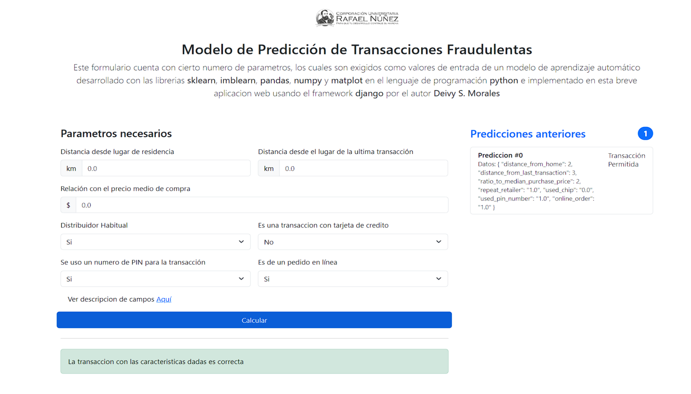

# Desarrollo e implementación web de un Modelo de Aprendizaje Automático para la predicción de transacciones fraudulentas en Python
El presente proyecto es el resultado de la investigación bajo el nombre antes mensionado, en donde se impleneta el modelo de aprendizaje con la mejores metricas para detectar transacciones fraudulentas, desarrollado por mi Deivy Sebastian Morales Peña como requisito para la obtención del titulo de Ingeniero de Sistemas, el cual obtuvo una valoracion Laureada en la Corporación Universitaria Rafael Núñez.

# Ilustración de la App

## Hacer entorno virtual (venv)
- navegar primero hacia la caprta donde se hara el proyecto
- py -m venv project-name

## Activar el entorno virtual (venv)
- project-name\Scripts\activate.bat 

## Hacer proyecto con django
django-admin startproject mysite
 

## Ejecutar servidor
 - python manage.py runserver

## Aplicar migraciones que no se han hecho
- python manage.py migrate 

## crear administrador de django
python manage.py createsuperuser

## Crear base para una aplicacion / modulo
- cd .\modulos\   
- django-admin startapp fraudulent_transactions
- python manage.py startapp polls

# migraciones
es un proceso de reflejar lo que nosostros en codigo estamos indiocando para que se refleje en la base de datos correspondiente
- python manage.py makemigrations
- python manage.py migrate 

numpy 1.23.5
pandas 1.5.3
scikitlearn 1.2.2

python -m venv C:\proyectos\DJANGO\01-primera-app\entorno
cd entorno
.\activate

pip install imbalanced-learn  
pip install scikit-learn===1.3.1
pip install seaborn

pip install imbalanced-learn===0.11.0
pip install seaborn===0.13.0

Ejecutar pip freeze > requirements.txt
